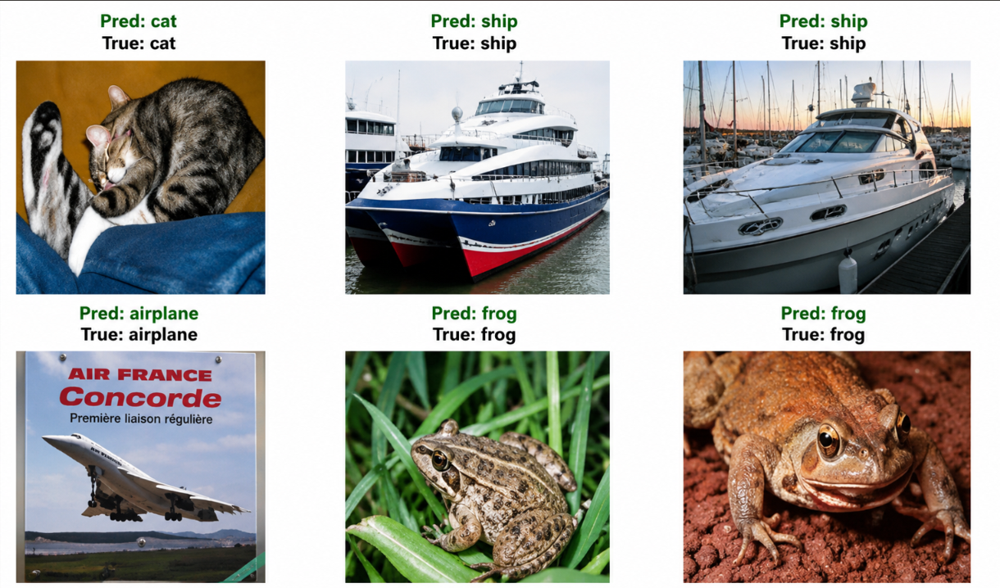

<h1 align="center">🧠 CNN Image Classification using PyTorch</h1>

<p align="center">
A Convolutional Neural Network built from scratch using PyTorch to classify images from the CIFAR-10 dataset.
</p>

<p align="center">


</p>

---

## 📌 Overview

This project implements a Convolutional Neural Network (CNN) from scratch using **PyTorch** to classify images from the **CIFAR-10** dataset.

The objective was to understand the complete CNN pipeline, including image preprocessing, feature extraction, training, evaluation, and prediction on unseen images.

---

## 📊 Results

| Metric | Value |
|---------|------:|
| Test Accuracy | **75.5%** |
| Final Training Loss | **0.1608** |
| Epochs | **10** |
| Dataset | CIFAR-10 |

---

## 🖼️ Sample Predictions

<p align="center">

</p>

---

## 🏗️ CNN Architecture

```
Input Image
      │
Convolution
      │
ReLU
      │
Max Pooling
      │
Convolution
      │
ReLU
      │
Max Pooling
      │
Flatten
      │
Fully Connected
      │
Output (10 Classes)
```

---

## 📂 Project Structure

```
cnn-image-classification-cifar10/
│
├── images/
│   ├── predictions.png
│   ├── accuracy.png
│
├── CNN_for_CIFAR10.ipynb
├── requirements.txt
├── README.md
```

---

## 🚀 Technologies Used

- Python
- PyTorch
- Torchvision
- NumPy
- Matplotlib

---

## 🎯 What I Learned

- Building a CNN from scratch using PyTorch
- Image preprocessing and normalization
- Convolution & Max Pooling layers
- Model training and evaluation
- Predicting unseen images
- Understanding feature extraction in CNNs

---

## 🔮 Future Improvements

- Data Augmentation
- Transfer Learning
- Confusion Matrix
- Precision, Recall & F1 Score
- Experiment with deeper CNN architectures

---

## ⚙️ Installation

```bash
git clone https://github.com/yourusername/cnn-image-classification-cifar10.git

cd cnn-image-classification-cifar10

pip install -r requirements.txt

jupyter notebook
```

---

## 👨‍💻 Author

**Harshit Soni**

If you have any suggestions or feedback, feel free to connect or open an issue.
